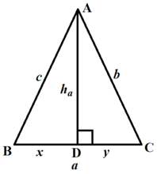
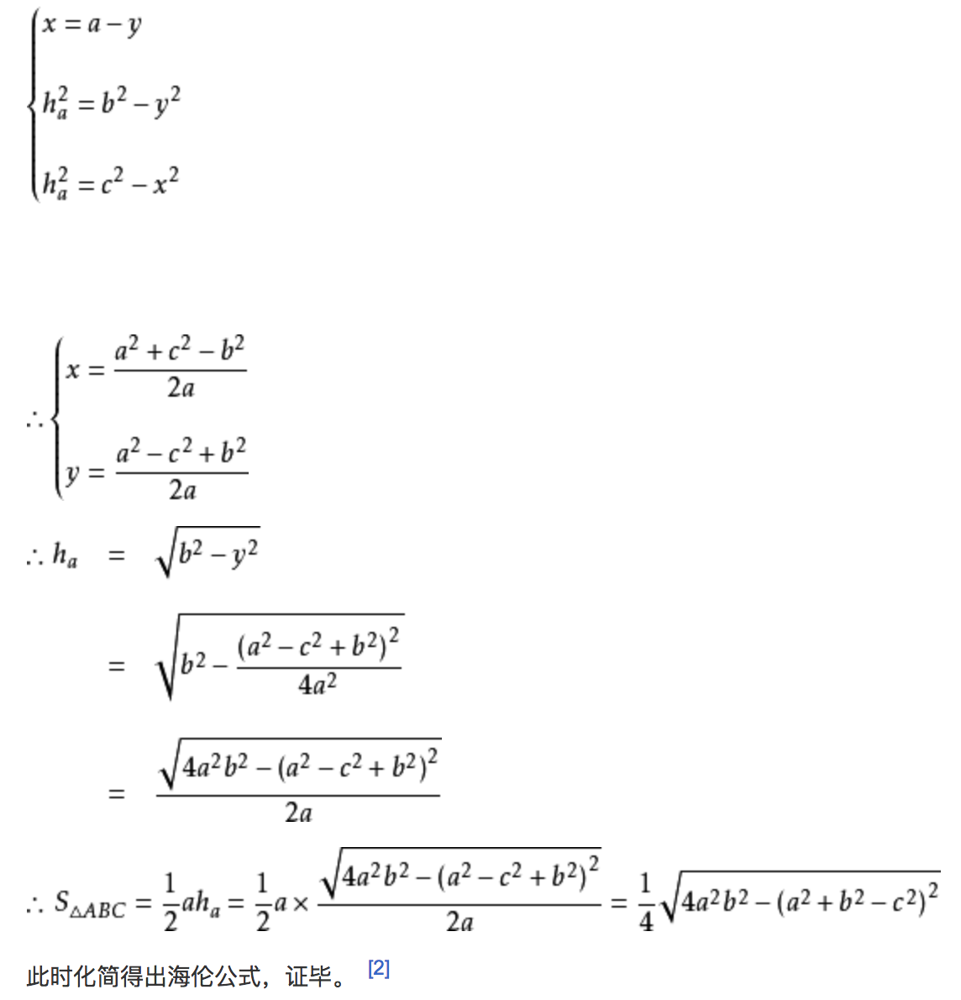

## Triangle Area

> 使用海伦公式求解三角形面积。
>
> https://baike.baidu.com/item/%E6%B5%B7%E4%BC%A6%E5%85%AC%E5%BC%8F

### 公式

对于三角形ABC，三边分别为a、b、c，它的面积为：

​	$area = \sqrt{p(p-a)(p-b)(p-c)}$

其中：

​	$p = \frac{a+b+c}{2}$

### 证明

证明方法使用**勾股定理**即可：

