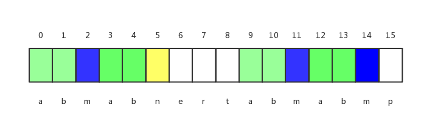

##   KMP

> 对于字符串source和target，找到在source中包含target的位置i，即`source[i, …, i + target.size - 1] == target`。时间复杂度为`O(source.size + target.size)`。


### 概述

最暴力的做法，是遍历source的每个位置，把当前遍历的位置i作为匹配字符串的起始位置，判断`source[i, …, i + target.size - 1]`和`target`是否相等。在每次匹配失败之后，source从`i + 1`，target要从`0`开始匹配。时间复杂度为`O(source.size * target.size)`。

KMP使用`next`数组，可以在每次匹配失败后，target不从`0`开始匹配，而是尽可能的少往左移。

`next`数组存储的是，对于target字符串，在当前位置`j`匹配失败后，要从哪个位置继续匹配。

例如下表的例子，在`j = 5`的位置匹配失败后，再从`j = 2`开始匹配即可。因为在`j = 5`、source当前匹配的起始位置为`i`的时候匹配失败，说明在`j >= 0 && j <= 4`的时候，在source匹配的其实位置`i`的匹配是成功的。说明在`i`这个位置，已经匹配到的内容为`match_str = abcab`，而`match_str`的前缀和后缀部分最长的内容为ab，所以下一个位置从ab的下一个字符开始匹配即可，即`j = 2`。

从例子可以看出，`next`数组实际上是，`next[i]`为字符串`source[0, …, i - 1]`的前缀和后缀部分最长的长度。也可以理解为把max_suffix_prefix数组向右移一位，第一位用-1填充。为什么`next[0] = -1`呢，因为在`j = -1`时候，说明i这个位置无法继续匹配了，只能从`i = i + 1`、`j =  j + 1 = 0`开始匹配。


| 下标              | 0 1 2 3 4 5   |
| ----------------- | ------------- |
| target            | a b c a  b m  |
| next              | -1 0 0 0 1  2 |
| max_suffix_prefix | 0 0 0 1 2  0  |

###匹配

在求得next数组后，可以用如下代码进行source和target的匹配。

```c++
int kmp() {
    int i = 0, j = 0;
    while (i < n && j < m) {
        if (j == -1 || source[i] == target[j]) {
            i++;
            j++;
        } else {
            j = nextt[j];
        }
    }
    if (j == m) {
        return i - j;
    }
    return -1;
}
```


### 求next数组

设`next[j] = k`，即`target[0, …, k - 1] == target[j - i - k + 1, j - 1]`，在求`next[j + 1]`时，

- 如果`target[k] == target[j]`或者`k==-1`，则`next[j + 1] = next[j] + 1 = k + 1`（k=1时， next[j + 1] = 0）。
- 否则的话，令`k = next[k]`，重复如上过程即可。因为`0-k`是`0-j`的后缀部分，而`0-next[k]`是`0-k`部分的最长前缀和后缀相同部分，所以`0-next[k]`也是`0-j`的后缀。。一个例子如下图所示，对于`j = 14`、`k = next[j] = 5`，`target[14] != target[5]`，所以令`k = next[k] = 2`，而`target[14] == target[2]`，所以`next[15] = 3`。



代码如下

```c++
void get_next() {
    nextt[0] = -1;
    int k = -1;
    int j = 0;
    while (j < m - 1) {
        if (k == -1 || target[k] == target[j]) {
            nextt[++j] = ++k;
        } else {
            k = nextt[k];
        }
    }
}
```


